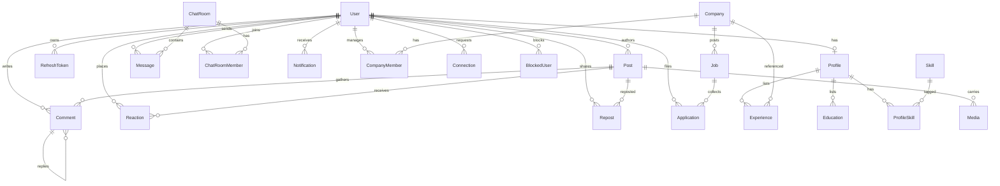

# ERD — Data Model Walkthrough

Authoritative schema: [`packages/db/prisma/schema.prisma`](../packages/db/prisma/schema.prisma). This document explains **why** the schema looks the way it does and the invariants every AI prompt must preserve.

## Cluster Map

## Key Decisions

### 1. `User` is the identity root
Everything owned by a person cascades on user delete **except** where audit matters (`Report`, `Notification.actorId` uses `SetNull`). The cascade list is enforced in the Prisma schema; do not relax it.

### 2. `Profile` is separate from `User`
`User` holds auth/identity only. `Profile` holds everything rendered publicly. This lets us:
- rotate profile shape without touching auth tables,
- keep the public profile endpoint cache-friendly,
- soft-disable a user without wiping their profile history.

Rule: `Profile` is 1:1 with `User` and is created at onboarding, not signup.

### 3. Connections are an undirected edge stored directionally
`Connection` has `requesterId` + `receiverId` + `status`. When querying "my network," `UNION` both sides where status=`ACCEPTED`. The `@@unique([requesterId, receiverId])` prevents dup requests; the reverse pair must also be blocked at service level.

### 4. Reactions are constrained to one per (user, post)
The `@@unique([userId, postId])` enforces the LinkedIn behavior: replacing a reaction mutates the row, not inserts a new one.

### 5. Comments are threaded one level deep
`Comment.parentId` is nullable and self-references. UI should **render one level of nesting only** (LinkedIn parity). Replies-of-replies flatten to the parent's thread — enforce in the service, not the DB.

### 6. Messaging uses rooms even for DMs
1:1 DMs are rooms with `isGroup=false` and exactly two `ChatRoomMember`s. This future-proofs for group chat without a migration. The service enforces the invariant.

### 7. Notifications are polymorphic by nullable FKs
`Notification` has `postId`, `commentId`, `connectionId`, `messageId`, `jobId` — all nullable. Exactly one should be set per notification, enforced at the service layer by a switch on `type`. Avoid a polymorphic `targetType/targetId` pattern because it defeats referential integrity.

### 8. Media is its own table
`Media` is referenced by `Post` now; later by `Message`, `Profile.avatar`, `Company.logo`, etc. Keep `url`, `kind`, `mimeType`, `sizeBytes` mandatory for audit.

### 9. Jobs are Palestine-defaulted
`Job.country = "PS"`, `Job.salaryCurrency = "ILS"`. Override at create time if posting for diaspora roles.

### 10. Full-text search for day one uses Postgres
`@@fulltext` on `Profile` (name, headline, about), `Post` (body), `Job` (title, description). This postpones OpenSearch/Elastic until scale demands it. When Postgres FTS stops being enough, add a `search` module without schema migration.

## Cascade & Soft-Delete Summary

| Table | On User delete | Has `deletedAt`? |
| --- | --- | --- |
| Profile | Cascade | No (soft-delete via `User.deletedAt`) |
| Experience / Education / ProfileSkill | Cascade via Profile | No |
| RefreshToken | Cascade | No |
| Post | Cascade | Yes |
| Comment | Cascade | Yes |
| Reaction / Repost | Cascade | No |
| Message | Cascade | Yes |
| ChatRoomMember | Cascade | No |
| Notification | Cascade (recipient); SetNull (actor) | No |
| Application | Cascade | No |
| CompanyMember | Cascade | No |
| Job | Cascade | Yes (posted by deleted user: cascade) |

Hard deletes should be rare. Soft-delete is the default for user-visible content so moderation and audit survive.

## Indexing Rules

- Every foreign-key column has an index.
- Every "feed-like" list (`Post`, `Message`, `Notification`, `Application`) has a compound index `(ownerId, createdAt)` for cursor queries.
- `Profile.handle`, `Company.slug` are unique and indexed for public URL lookups.
- Add new indexes **only** after an `EXPLAIN ANALYZE` shows a slow path. Do not pre-index speculatively.

## Prohibited Patterns

- Do not add a `type: String` discriminator column to replace the polymorphic FKs — use nullable FKs as above.
- Do not add JSON columns for structured data (skills, education) — use relational tables.
- Do not store file bytes in Postgres — use Cloudflare R2.
- Do not store plaintext passwords or refresh tokens — bcrypt (cost 12) / SHA-256 respectively.
